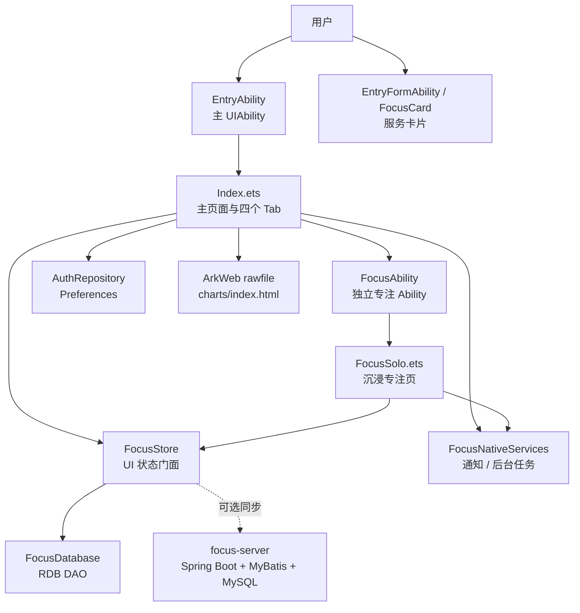

# Focus 学习专注 App 详细设计文档

课程：鸿蒙应用开发期末大作业
项目名称：Focus
项目定位：本地优先的学习任务管理与番茄专注 App
当前版本：2026-05-25 深度重构版
开发者：kyc
工作目录：`D:\Study\26sp\arkts\final`

## 1. 项目概述

Focus 是一个面向大学生和自我驱动学习者的学习效率工具。它的核心不是简单地做一个倒计时页面，而是形成一条完整闭环：

```text
记录任务 -> 选择任务 -> 进入番茄专注 -> 完成或中断 -> 写入本地记录 -> 查看复盘统计
```

本项目采用“本地优先”设计。任务、项目、番茄记录等核心数据保存到鸿蒙端 RDB 数据库；登录态、游客模式等轻量状态保存到 Preferences。Spring Boot 后端保留为可选同步与课程全栈展示层，不作为 App 正常使用的前提。

这样的取舍更适合番茄钟类产品：用户即使没有网络、没有启动后端、只使用游客模式，也能完成任务管理、专注计时和复盘统计。

## 2. 需求目标与产品闭环

### 2.1 核心目标

1. 让用户快速记录今天要完成的学习任务。
2. 让用户能从任务进入 25 分钟番茄专注。
3. 让完成和中断都成为真实记录，而不是只在页面上临时显示。
4. 让复盘页基于本地真实数据计算学习时长、完成率、项目占比和中断次数。
5. 展示鸿蒙课程中的 ArkTS、声明式 UI、状态管理、UIAbility、Want、Preferences、RDB、ArkWeb、服务卡片、通知与后台任务等知识点。
6. 保留 Spring Boot + MyBatis + MySQL 后端，展示 Java 后端和数据库 CRUD / 同步接口能力。

### 2.2 使用场景

典型使用流程如下：

1. 用户打开 App，选择本地账户登录或游客模式。
2. 在“今日”页快速添加学习任务。
3. 在任务列表中选择一项任务，进入专注页或独立 `FocusAbility`。
4. 用户开始番茄计时，可以暂停、完成、重置，也可以记录中断原因。
5. 番茄结束后，App 将记录写入 RDB。
6. 用户在“复盘”页查看本周专注时长、项目时间占比、完成和中断统计。
7. 如果需要全栈展示，可以说明数据未来可通过后端同步接口备份到 MySQL。

### 2.3 已实现与可选范围

| 范围 | 状态 | 说明 |
| --- | --- | --- |
| 本地账户 / 游客模式 | 已实现 | 使用 Preferences 保存登录态 |
| 任务新增、完成、软删除、恢复 | 已实现 | 所有写操作经过 `FocusStore` 和 RDB |
| 番茄开始、暂停、完成、中断 | 已实现 | 完成和中断都会写入 `pomodoros` |
| 复盘统计 | 已实现 | 统计来自本地 `FocusStore` 快照 |
| 独立 `FocusAbility` | 已实现 | 支持 Want 参数和 singleton 热启动 |
| ArkWeb 复盘页 | 已接入 | 真机或模拟器需要继续验证渲染效果 |
| 服务卡片 | 已配置并可构建 | 设备上添加卡片仍需手动验证 |
| Spring Boot 后端 | 已保留 | 作为可选同步 / 全栈课程展示 |
| 完整同步 UI、JWT、RCP、AI 排程 | 后续扩展 | 不作为当前核心交付 |

## 3. 总体架构设计

### 3.1 架构图



### 3.2 分层说明

| 层级 | 主要文件 | 职责 |
| --- | --- | --- |
| Ability 层 | `EntryAbility.ets`、`FocusAbility.ets` | 负责窗口创建、页面加载、Ability 生命周期、Want 参数解析 |
| 页面层 | `Index.ets`、`FocusSolo.ets` | 负责 ArkUI 声明式 UI、用户操作、页面状态 |
| 状态门面层 | `FocusStore.ets` | 面向 UI 提供任务、番茄和统计接口 |
| 本地数据层 | `FocusDatabase.ets` | RDB 建表、迁移、查询、写入、ResultSet 释放 |
| 身份仓库层 | `AuthRepository.ets` | Preferences 本地登录态、游客模式 |
| 原生能力层 | `FocusNativeServices.ets` | 通知权限、通知发布、后台延迟任务申请 |
| 混合开发层 | `rawfile/charts/index.html` | ArkWeb 加载 H5 复盘页，并通过 bridge 获取统计数据 |
| 服务卡片层 | `EntryFormAbility.ets`、`FocusCard.ets` | 展示今日任务和番茄进度入口 |
| 可选后端层 | `focus-server/` | 登录、项目、任务、番茄、统计、同步接口展示 |

### 3.3 本地优先设计原则

本项目最重要的架构原则是：RDB 是核心业务数据的第一可信来源。

具体表现为：

- 新增任务先写 RDB，再刷新 UI。
- 完成 / 删除 / 恢复任务先更新 RDB，再刷新 Store。
- 完成番茄先写 `pomodoros`，再增加任务的 `pomodoro_count`。
- 复盘统计从 `FocusStore.pomodoros` 和 `FocusStore.tasks` 计算。
- 后端即使没有启动，也不影响 App 核心流程。

后端只作为 optional layer：可以用于课程演示、数据备份、同步接口设计说明，但不阻塞本地使用。

## 4. 工程目录结构

```text
final/
├── 需求文档.md
├── 设计文档.md
├── HANDOVER.md
├── entry/
│   └── src/main/
│       ├── module.json5
│       ├── ets/
│       │   ├── entryability/EntryAbility.ets
│       │   ├── focusability/FocusAbility.ets
│       │   ├── entryformability/EntryFormAbility.ets
│       │   ├── pages/Index.ets
│       │   ├── pages/FocusSolo.ets
│       │   ├── formpages/FocusCard.ets
│       │   ├── models/FocusModels.ets
│       │   ├── data/SeedData.ets
│       │   ├── services/FocusDatabase.ets
│       │   ├── services/FocusStore.ets
│       │   ├── services/FocusNativeServices.ets
│       │   └── repository/AuthRepository.ets
│       └── resources/
│           ├── rawfile/charts/index.html
│           └── base/profile/form_config.json
└── focus-server/
    ├── pom.xml
    └── src/main/
        ├── java/com/focus/server/
        │   ├── controller/
        │   ├── dto/
        │   ├── entity/
        │   ├── mapper/
        │   └── common/
        └── resources/
            ├── init.sql
            ├── application.yml
            └── mapper/*.xml
```

## 5. 前端模块详细设计

### 5.1 应用配置与 Ability 声明

核心文件：`entry/src/main/module.json5`

`module.json5` 是鸿蒙应用入口配置文件。当前模块声明了：

- 主 Ability：`EntryAbility`
- 独立专注 Ability：`FocusAbility`
- 服务卡片扩展：`EntryFormAbility`
- 备份扩展：`EntryBackupAbility`
- 请求权限：
  - `ohos.permission.NOTIFICATION_CONTROLLER`
  - `ohos.permission.KEEP_BACKGROUND_RUNNING`
  - `ohos.permission.VIBRATE`

`FocusAbility` 的 `launchType` 设置为 `singleton`，表示同一个 Ability 只保留一个实例。这样用户从不同任务进入独立专注窗口时，不会不断创建新窗口，而是通过 `onNewWant` 更新当前任务。

涉及课程知识：

- HAP 模块配置。
- UIAbility 与 ExtensionAbility 声明。
- Ability 启动模式。
- 权限声明。

### 5.2 主入口 EntryAbility

核心文件：`entry/src/main/ets/entryability/EntryAbility.ets`

`EntryAbility` 负责 App 主窗口生命周期：

- `onCreate`：设置应用色彩模式并记录日志。
- `onWindowStageCreate`：调用 `windowStage.loadContent('pages/Index')` 加载主页面。
- `onForeground` / `onBackground`：记录前后台切换。
- `onDestroy`：记录销毁。

它的职责比较克制，只负责 Ability 生命周期和页面加载，不把业务逻辑塞进 Ability。业务数据初始化在 `Index.ets` 中通过 `UIAbilityContext` 完成。

涉及课程知识：

- UIAbility 生命周期。
- WindowStage 页面加载。
- Ability 与 Page 的层级关系。

### 5.3 数据模型 FocusModels

核心文件：`entry/src/main/ets/models/FocusModels.ets`

该文件定义前端核心类型：

| 类型 | 说明 |
| --- | --- |
| `TaskStatus` | 任务状态枚举：TODO、DONE、DELETED |
| `PomodoroStatus` | 计时器状态：IDLE、RUNNING、PAUSED、BREAK、FINISHED |
| `FocusProject` | 项目：id、名称、颜色、图标 |
| `FocusTask` | 任务：标题、备注、项目、优先级、截止时间、状态、番茄数、标签、子任务 |
| `PomodoroRecord` | 番茄记录：任务 ID、开始时间、时长、完成状态、中断原因 |
| `FocusSettings` | 番茄时长、休息时长、主题色、白噪音、通知开关 |
| `ForestPlant` | 学习森林成就项 |
| `StatPoint` | 统计图表数据点 |

这里把 UI 所需的数据结构统一成 ArkTS interface，避免页面层到处写散乱字段。

关键约定：

- 所有时间戳使用 Unix milliseconds。
- `PomodoroRecord.duration` 使用秒。
- 任务状态值：
  - `0`：待办
  - `1`：完成
  - `2`：删除
- 番茄完成状态：
  - `1`：完成
  - `0`：中断

涉及课程知识：

- ArkTS interface。
- enum 状态建模。
- 类型约束和跨模块 import / export。

### 5.4 默认数据 SeedData

核心文件：`entry/src/main/ets/data/SeedData.ets`

`SeedData` 提供首次初始化数据：

- 默认项目：数据库、科研、协程演讲、移动开发。
- 默认任务：实验报告复盘、数据库索引总结、论文阅读、演讲排练、答辩话术整理。
- 默认番茄记录：用于首次进入时复盘页有可展示数据。
- 默认设置：25 分钟专注、5 分钟短休、15 分钟长休。
- 学习森林植物：根据番茄数和 streak 解锁。

这些数据只用于空库初始化，不作为长期真实数据来源。初始化后，页面统计应读取 RDB 中的数据，而不是每次都读取种子数据。

涉及课程知识：

- 模块化数据组织。
- 首次启动初始化。
- 本地持久化与展示数据分离。

### 5.5 RDB 数据层 FocusDatabase

核心文件：`entry/src/main/ets/services/FocusDatabase.ets`

`FocusDatabase` 是本地 RDB 的 DAO 层，负责打开数据库、建表、迁移、查询和写入。数据库名称为 `focus.db`，版本为 `2`。

主要职责：

1. `init(context)`：通过 `relationalStore.getRdbStore` 打开数据库。
2. `createTables()`：创建 `projects`、`tasks`、`pomodoros` 三张表。
3. `addColumnIfMissing()`：通过 `PRAGMA table_info` 检查字段是否存在，补充缺失字段。
4. `seedIfEmpty()`：空库时写入默认项目、任务和番茄记录。
5. 查询方法：
   - `getProjects()`
   - `getTasks()`
   - `getPomodoros()`
6. 写入方法：
   - `addTask()`
   - `upsertProject()`
   - `upsertTask()`
   - `updateTask()`
   - `recordPomodoro()`
   - `incrementTaskPomodoro()`

实现重点：

- RDB 表字段使用下划线命名，如 `project_id`、`created_at`、`tags_json`。
- ArkTS 模型使用驼峰命名，如 `projectId`、`createdAt`、`tags`。
- `tags` 和 `subtasks` 在 ArkTS 中是数组，在 RDB 中使用 JSON 字符串保存。
- 所有 `ResultSet` 查询都在 `finally` 中调用 `close()`，避免资源泄漏。
- `longValue()` 和 `stringValue()` 对空字段提供兜底值，避免空值导致页面崩溃。
- `requireStore()` 保证数据库未初始化时抛出明确错误。

涉及课程知识：

- RDB / SQLite 本地持久化。
- RdbStore、SQL 建表、查询、插入、更新。
- ResultSet 遍历与释放。
- 数据库迁移思路。
- JSON 序列化保存复杂字段。

### 5.6 状态门面 FocusStore

核心文件：`entry/src/main/ets/services/FocusStore.ets`

`FocusStore` 是 UI 面向的数据门面。它不直接替代数据库，而是把 RDB 数据读取成页面可用快照。

核心字段：

- `projects`
- `tasks`
- `pomodoros`
- `settings`
- `plants`

核心方法：

| 方法 | 说明 |
| --- | --- |
| `refresh()` | 从 RDB 重新读取项目、任务、番茄 |
| `getTodayTasks()` | 获取待办任务并按优先级、截止时间排序 |
| `getActiveTasks()` | 获取未删除任务 |
| `getDeletedTasks()` | 获取回收站任务 |
| `addTask()` | 新增任务到 RDB 并刷新 |
| `toggleTask()` | 待办 / 完成切换 |
| `softDeleteTask()` | 软删除任务 |
| `restoreTask()` | 从回收站恢复任务 |
| `recordPomodoro()` | 写入番茄记录，完成时增加任务番茄数 |
| `weekFocusPoints()` | 计算本周每日专注分钟 |
| `projectFocusPoints()` | 计算项目时间占比 |
| `streakDays()` | 计算连续打卡天数 |
| `unlockedPlants()` | 根据番茄数和 streak 解锁学习森林 |

写操作统一模式：

```text
UI 操作 -> FocusStore 方法 -> FocusDatabase 写入 -> FocusStore.refresh() -> 页面 syncFromStore()
```

这样可以保证 UI、Store、RDB 三者不会长期不一致。

涉及课程知识：

- 状态管理。
- Promise 异步处理。
- 分层架构。
- 本地数据作为单一可信源。

### 5.7 登录与游客模式 AuthRepository

核心文件：`entry/src/main/ets/repository/AuthRepository.ets`

`AuthRepository` 使用 Preferences 保存轻量身份信息。当前不是强制联网登录，而是本地账户和游客模式。

保存字段：

- `auth.token`
- `auth.username`
- `auth.nickname`
- `auth.guest`

核心方法：

| 方法 | 说明 |
| --- | --- |
| `init(context)` | 获取 `focus_auth` Preferences |
| `currentProfile()` | 读取当前登录态 |
| `loginLocal(username, nickname)` | 创建本地账户登录态 |
| `guest()` | 创建游客模式登录态 |
| `logout()` | 删除 token 并 flush |

本地 token 使用 `local-${Date.now()}` 或 `guest-${Date.now()}` 生成，只用于区分本地会话，不代表后端 JWT。

涉及课程知识：

- Preferences KV 存储。
- 轻量配置与登录态持久化。
- `flush()` 持久化。
- 本地优先产品设计。

### 5.8 主页面 Index

核心文件：`entry/src/main/ets/pages/Index.ets`

`Index.ets` 是当前 App 的主体验页面，包含登录页和四个核心 Tab：

- 今日
- 任务
- 专注
- 复盘

它承担的职责较多，是当前项目中最大的 ArkTS 页面。为了期末交付稳定，没有强行拆分成大量组件；后续工程化时可以按 Tab 提取到 `components/` 或 `viewmodel/`。

#### 5.8.1 页面状态

主要 `@State` 字段包括：

- 登录状态：`isAuthed`、`loginName`、`loginNickname`、`currentNickname`、`currentModeText`
- Tab 状态：`activeTab`
- 数据快照：`tasks`、`records`、`settings`
- 任务操作：`selectedTaskId`、`newTaskTitle`、`searchText`、`filterProjectId`、`filterPriority`、`showRecycle`
- 计时器：`timerStatus`、`remainingSeconds`、`elapsedSeconds`
- 中断记录：`interruptionReason`、`showInterruptDialog`
- 原生服务状态：`serviceMessage`、`notificationReady`

#### 5.8.2 启动初始化

主页面启动后执行本地初始化：

```text
getContext(this)
-> focusDatabase.init(context)
-> focusStore.refresh()
-> syncFromStore()
-> authRepository.init(context)
-> authRepository.currentProfile()
```

这个流程保证页面显示的数据来自 RDB，而不是仅依赖内存默认值。

#### 5.8.3 登录页

登录页提供：

- 本地账户登录。
- 游客模式。
- 本地优先 / RDB 持久化 / 番茄闭环的产品提示。

点击登录后调用 `authRepository.loginLocal()`，游客模式调用 `authRepository.guest()`。登录态保存后更新 `isAuthed` 和昵称展示。

#### 5.8.4 今日 Tab

今日页目标是回答“我下一步该做什么”。

主要区域：

- Hero 卡片：显示当前学习状态、完成率、专注分钟、连续天数。
- 快速添加任务：输入标题后直接写入本地 RDB。
- 下一段专注：展示当前选择任务，并可进入专注。
- 今日待办列表：按优先级和截止时间排序。

新增任务流程：

```text
输入任务标题
-> addQuickTask()
-> focusStore.addTask(title, projectId, priority, dueOffsetHours)
-> focusDatabase.addTask()
-> focusStore.refresh()
-> syncFromStore()
```

#### 5.8.5 任务 Tab

任务页用于管理任务，不做复杂企业项目管理。

已实现能力：

- 搜索标题、备注、标签。
- 按项目筛选。
- 按优先级筛选。
- 显示全部任务和回收站。
- 完成 / 取消完成。
- 软删除 / 恢复。
- 展示项目标签、优先级、截止时间、番茄数、备注和子任务。

软删除设计使用 `TaskStatus.DELETED`，不是直接物理删除。这样用户可以在回收站恢复，也便于未来同步层处理删除状态。

#### 5.8.6 专注 Tab

专注页提供番茄计时核心体验：

- 开始。
- 暂停。
- 完成。
- 重置。
- 中断原因记录。
- 通知权限申请。
- 后台任务 best-effort 保护。

完成番茄流程：

```text
completePomodoro()
-> 获取 selected task
-> focusStore.recordPomodoro(task.id, duration, true, '')
-> FocusDatabase.recordPomodoro()
-> FocusDatabase.incrementTaskPomodoro()
-> focusStore.refresh()
-> syncFromStore()
-> FocusNotificationService.publishBasic()
```

中断番茄流程：

```text
用户输入中断原因
-> interruptPomodoro()
-> focusStore.recordPomodoro(task.id, elapsedSeconds, false, reason)
-> 写入 pomodoros
-> 不增加任务番茄数
-> 复盘页可统计中断次数
```

#### 5.8.7 复盘 Tab

复盘页由原生统计视图和 ArkWeb 混合复盘组成。

原生统计包括：

- 总专注分钟。
- 完成率。
- 最长 streak。
- 本周学习时长柱状图。
- 项目时间占比。
- 完成 / 中断统计。
- 学习森林成就。

这些统计均来自 `FocusStore` 计算，而不是固定假数据。

#### 5.8.8 ArkWeb Bridge

`Index.ets` 中定义 `ReviewBridge`，向 H5 暴露 `getStats()` 等方法。ArkWeb 页面通过 `nativeBridge.getStats()` 获取统计数据。

关键点：

- Web 资源路径：`$rawfile('charts/index.html')`
- 注入对象名：`nativeBridge`
- 数据来源：`focusStore.weekFocusPoints()`、`focusStore.totalFocusMinutes()`、`focusStore.completedPomodoros()`、`focusStore.streakDays()`

涉及课程知识：

- ArkTS 声明式 UI。
- `@State` 状态管理。
- Tabs / Scroll / ForEach / 条件渲染。
- ArkWeb 加载 rawfile。
- ArkTS 与 H5 双向调用。

### 5.9 独立专注 Ability

核心文件：

- `entry/src/main/ets/focusability/FocusAbility.ets`
- `entry/src/main/ets/pages/FocusSolo.ets`

#### 5.9.1 FocusAbility

`FocusAbility` 是独立专注窗口，配置为 singleton。

它解析的 Want 参数：

```typescript
{
  taskId: number,
  taskTitle: string
}
```

关键实现：

- `onCreate(want)` 中解析 Want。
- `onNewWant(want)` 中也解析 Want。
- 将参数写入 AppStorage：
  - `focus.taskId`
  - `focus.taskTitle`
- `onWindowStageCreate` 加载 `pages/FocusSolo`。

为什么 `onNewWant` 很重要：

由于 `FocusAbility` 是 singleton，如果用户先从任务 A 打开独立专注窗口，再从任务 B 打开，系统可能复用已有 Ability 实例。此时只写 `onCreate` 会导致页面仍显示任务 A。当前实现同时处理冷启动和热启动，避免该问题。

#### 5.9.2 FocusSolo

`FocusSolo` 通过 `@StorageProp` 读取 `focus.taskId` 和 `focus.taskTitle`，显示沉浸式专注页。

主要能力：

- 25 分钟倒计时。
- 开始 / 暂停 / 完成 / 重置。
- 使用 `FocusBackgroundService` 申请后台延迟任务。
- 完成后调用 `focusStore.recordPomodoro()` 写入 RDB。
- 发布本地通知。
- 如果 RDB 初始化失败，页面给出降级提示，计时仍可继续。

涉及课程知识：

- UIAbility 启动模式。
- Want 参数传递。
- AppStorage 跨页面 / Ability 状态共享。
- 冷启动与热启动处理。
- 独立窗口页面加载。

### 5.10 原生能力封装 FocusNativeServices

核心文件：`entry/src/main/ets/services/FocusNativeServices.ets`

该文件封装两个能力：

#### 通知服务

`FocusNotificationService` 提供：

- `requestPermission()`：请求通知权限。
- `publishBasic(title, text)`：发布基础文本通知。

通知发布使用 `notificationManager.publish()`。如果权限或设备能力不足，捕获异常并记录日志，不让通知失败影响番茄记录写入。

#### 后台任务保护

`FocusBackgroundService` 提供：

- `startPomodoroGuard()`：调用 `backgroundTaskManager.requestSuspendDelay()` 申请延迟挂起。
- `stopPomodoroGuard()`：调用 `cancelSuspendDelay()` 释放后台任务。

这里采用 best-effort 设计。后台任务在不同设备和 syscap 下可能存在差异，因此失败时只返回温和提示，页面计时和本地记录仍继续。

涉及课程知识：

- 通知模块。
- 后台任务 / 资源调度。
- 设备能力差异处理。
- 异常捕获与降级体验。

### 5.11 服务卡片

核心文件：

- `entry/src/main/ets/entryformability/EntryFormAbility.ets`
- `entry/src/main/ets/formpages/FocusCard.ets`
- `entry/src/main/resources/base/profile/form_config.json`

服务卡片用于在桌面展示 Focus 的轻量状态。

`EntryFormAbility` 提供默认卡片数据：

- 标题：Focus 今日
- 副标题：本地学习闭环
- 进度：4/6 番茄
- Top 3 任务

`FocusCard` 负责卡片 UI，使用 `FormLink` 跳转到 `EntryAbility`，展示今日任务和番茄进度条。

当前卡片数据为静态展示数据，主要用于课程展示服务卡片配置和构建能力。后续可以接入真实 RDB 快照或卡片更新机制。

涉及课程知识：

- FormExtensionAbility。
- 服务卡片页面。
- FormLink 跳转。
- 卡片 profile 配置。

### 5.12 ArkWeb 混合复盘页

核心文件：`entry/src/main/resources/rawfile/charts/index.html`

该 HTML 页面部署在 rawfile 目录，由 ArkWeb 加载。页面内容包括：

- 专注分钟。
- 完成番茄数。
- 连续打卡天数。
- Canvas 周学习时长图表。
- 导出图表 / 分享报告按钮。

H5 侧调用：

```javascript
window.nativeBridge.getStats()
```

ArkTS 侧注入：

```text
javaScriptProxy:
object: reviewBridge
name: nativeBridge
```

如果 bridge 不可用，H5 使用 fallback 数据，避免页面空白。但正式统计数据应来自 ArkTS 注入对象。

涉及课程知识：

- ArkWeb。
- rawfile 资源部署。
- ArkTS 注入对象。
- H5 调用 ArkTS 方法。
- Canvas 绘图。

## 6. 本地数据库设计

### 6.1 RDB 总体约定

数据库：`focus.db`
版本：`2`
安全等级：`relationalStore.SecurityLevel.S1`

统一约定：

- 时间戳使用 Unix milliseconds。
- 番茄时长使用秒。
- 软删除使用状态字段，不直接删除核心业务数据。
- 查询结果集必须释放。
- ArkTS 数组字段序列化为 JSON 字符串。

### 6.2 projects 表

| 字段 | 类型 | 说明 |
| --- | --- | --- |
| id | INTEGER PRIMARY KEY | 项目 ID |
| name | TEXT NOT NULL | 项目名称 |
| color | TEXT NOT NULL | 项目展示色 |
| icon | TEXT NOT NULL | 项目图标或缩写 |
| updated_at | INTEGER | 更新时间 |
| is_deleted | INTEGER | 软删除标记 |

用途：管理任务所属项目，用于任务筛选和项目时间占比统计。

### 6.3 tasks 表

| 字段 | 类型 | 说明 |
| --- | --- | --- |
| id | INTEGER PRIMARY KEY AUTOINCREMENT | 任务 ID |
| title | TEXT NOT NULL | 标题 |
| note | TEXT | 备注 |
| project_id | INTEGER | 项目 ID |
| priority | INTEGER | 优先级 |
| due_at | INTEGER | 截止时间 |
| status | INTEGER | 0 待办、1 完成、2 删除 |
| pomodoro_count | INTEGER | 已完成番茄数 |
| created_at | INTEGER | 创建时间 |
| updated_at | INTEGER | 更新时间 |
| completed_at | INTEGER | 完成时间 |
| tags_json | TEXT | 标签 JSON |
| subtasks_json | TEXT | 子任务 JSON |

用途：记录任务本体和展示属性，是今日页、任务页、专注页、复盘页共同依赖的核心表。

### 6.4 pomodoros 表

| 字段 | 类型 | 说明 |
| --- | --- | --- |
| id | INTEGER PRIMARY KEY AUTOINCREMENT | 番茄记录 ID |
| task_id | INTEGER | 关联任务 ID |
| start_at | INTEGER | 开始时间 |
| duration | INTEGER | 持续秒数 |
| completed | INTEGER | 1 完成、0 中断 |
| interrupt_reason | TEXT | 中断原因 |
| updated_at | INTEGER | 更新时间 |

用途：记录每一次专注行为。复盘页的总时长、周统计、中断次数均来自该表。

### 6.5 Preferences

Preferences 文件名：`focus_auth`

| key | 说明 |
| --- | --- |
| `auth.token` | 本地会话 token |
| `auth.username` | 用户名 |
| `auth.nickname` | 昵称 |
| `auth.guest` | 是否游客模式 |

后续可以扩展保存：

- 番茄时长。
- 通知开关。
- 白噪音偏好。
- 后端 baseUrl。
- 同步游标。

## 7. 核心业务流程

### 7.1 App 启动流程

```text
EntryAbility.onWindowStageCreate
-> loadContent('pages/Index')
-> Index.aboutToAppear
-> focusDatabase.init(context)
-> createTables / seedIfEmpty
-> focusStore.refresh()
-> syncFromStore()
-> authRepository.init(context)
-> currentProfile()
-> 展示登录页或主页面
```

### 7.2 本地登录流程

```text
用户输入用户名和昵称
-> doLocalLogin()
-> authRepository.loginLocal()
-> Preferences put auth.*
-> flush()
-> 更新 @State 登录状态
```

游客模式类似，只是 `guest` 为 true，`userId` 为 0。

### 7.3 新增任务流程

```text
今日页输入任务标题
-> addQuickTask()
-> focusStore.addTask()
-> 组装 FocusTask
-> focusDatabase.addTask()
-> RDB insert tasks
-> focusStore.refresh()
-> syncFromStore()
-> UI 显示新任务
```

### 7.4 完成 / 取消完成任务

```text
点击任务勾选按钮
-> toggleTask(taskId)
-> focusStore.toggleTask(taskId)
-> 根据当前状态切换 TODO / DONE
-> focusDatabase.updateTask()
-> focusStore.refresh()
-> syncFromStore()
```

### 7.5 软删除 / 恢复任务

软删除：

```text
点击删除
-> focusStore.softDeleteTask(taskId)
-> status = TaskStatus.DELETED
-> updateTask()
```

恢复：

```text
回收站点击恢复
-> focusStore.restoreTask(taskId)
-> status = TaskStatus.TODO
-> updateTask()
```

### 7.6 完成番茄流程

```text
点击完成
-> completePomodoro()
-> focusStore.recordPomodoro(taskId, duration, true, '')
-> insert pomodoros
-> increment tasks.pomodoro_count
-> focusStore.refresh()
-> syncFromStore()
-> 发布完成通知
```

### 7.7 中断番茄流程

```text
点击中断
-> 输入中断原因
-> interruptPomodoro()
-> focusStore.recordPomodoro(taskId, duration, false, reason)
-> insert pomodoros
-> 不增加任务番茄数
-> 复盘页统计中断记录
```

### 7.8 独立 FocusAbility 流程

```text
点击进入专注
-> context.startAbility({
     abilityName: 'FocusAbility',
     parameters: { taskId, taskTitle }
   })
-> FocusAbility.onCreate 或 onNewWant
-> parseWant()
-> AppStorage 写入 focus.taskId / focus.taskTitle
-> loadContent('pages/FocusSolo')
-> FocusSolo 通过 @StorageProp 读取任务
-> 完成后写入 RDB
```

### 7.9 复盘统计流程

```text
focusStore.refresh()
-> tasks / pomodoros 快照
-> totalFocusMinutes()
-> weekFocusPoints()
-> projectFocusPoints()
-> streakDays()
-> ReviewTab 原生图表渲染
-> ArkWeb bridge 提供同一份统计数据
```

## 8. 可选后端设计

后端目录：`focus-server/`

后端不是 App 的主线依赖，而是课程全栈展示层。其定位是：

- 展示 Spring Boot 工程结构。
- 展示 Maven 依赖管理。
- 展示 MyBatis Mapper 和 XML。
- 展示 MySQL 表结构。
- 展示登录、任务、项目、番茄、统计、同步接口。

### 8.1 技术栈

| 技术 | 用途 |
| --- | --- |
| Spring Boot 3.2.0 | Web 服务框架 |
| MyBatis | SQL Mapper |
| MySQL | 后端数据库 |
| Maven | 依赖管理与打包 |
| Lombok | 减少 DTO / Entity 样板代码 |

### 8.2 后端目录

```text
focus-server/src/main/java/com/focus/server/
├── FocusServerApplication.java
├── common/
│   ├── Result.java
│   ├── PageResult.java
│   └── HashUtil.java
├── config/CorsConfig.java
├── controller/
│   ├── UserController.java
│   ├── ProjectController.java
│   ├── TaskController.java
│   ├── PomodoroController.java
│   ├── StatsController.java
│   └── SyncController.java
├── dto/
├── entity/
└── mapper/
```

### 8.3 接口模块

| Controller | 路径 | 说明 |
| --- | --- | --- |
| `UserController` | `/api/user` | 注册、登录 |
| `ProjectController` | `/api/projects` | 项目 CRUD |
| `TaskController` | `/api/tasks` | 任务 CRUD |
| `PomodoroController` | `/api/pomodoros` | 番茄记录 |
| `StatsController` | `/api/stats/summary` | 聚合统计 |
| `SyncController` | `/api/sync/pull`、`/api/sync/push` | 增量拉取与批量上传 |

### 8.4 数据库设计

后端初始化脚本：`focus-server/src/main/resources/init.sql`

后端表包括：

- `users`
- `projects`
- `tasks`
- `pomodoros`

后端表比前端 RDB 多了：

- `user_id`：区分用户。
- `client_request_id`：用于同步幂等。
- `is_deleted`：服务端软删除标记。
- 索引：如 `idx_tasks_user_updated`、`idx_pomodoros_user_start`。

### 8.5 同步接口设计

`SyncController` 包含：

- `POST /api/sync/pull?since=...`
  - 返回某个时间点之后更新的项目、任务、番茄。
  - 返回 `serverTime` 作为同步游标参考。

- `POST /api/sync/push`
  - 接收本地批量上传的 projects、tasks、pomodoros。
  - 根据是否有 id 决定 insert 或 update。
  - 对番茄记录使用 `clientRequestId` 尝试避免重复插入。

当前前端没有把同步 UI 完整产品化，因此后端同步属于可选演示能力。答辩时可以讲清楚：本地写入先成功，后端同步后尝试；后端失败不回滚本地操作。

涉及课程知识：

- Java 面向对象。
- Spring Boot Controller。
- MyBatis Mapper / XML。
- Maven 依赖。
- Lombok 注解。
- MySQL 表设计。
- CRUD 与前后端联调。

## 9. 课程知识点映射

| 课程知识点 | 项目实现 |
| --- | --- |
| ArkTS 语法 | interface、enum、class、Promise、模块 import / export |
| 声明式 UI | `Index.ets`、`FocusSolo.ets`、`FocusCard.ets` 使用 ArkUI 组件声明界面 |
| 基础组件 | Text、Button、Column、Row、Stack、Scroll、Tabs、Progress、TextInput |
| 状态管理 | `@State` 管页面状态，`@StorageProp` 读 AppStorage，`FocusStore` 管业务快照 |
| Grid / Tabs 布局实践 | 主页面使用 Tabs 构建“今日 / 任务 / 专注 / 复盘”信息架构 |
| HAP 与模块配置 | `module.json5` 声明 Ability、ExtensionAbility、权限、页面 |
| UIAbility 生命周期 | `EntryAbility` 和 `FocusAbility` 处理创建、窗口加载、前后台 |
| WindowStage | `loadContent('pages/Index')`、`loadContent('pages/FocusSolo')` |
| 启动模式 | `FocusAbility` 使用 `singleton` |
| Want 传参 | `taskId`、`taskTitle` 从主页面传到独立专注 Ability |
| 冷 / 热启动 Want 解析 | `onCreate` 和 `onNewWant` 都调用 `parseWant()` |
| AppStorage | `focus.taskId`、`focus.taskTitle` 跨页面读取 |
| Preferences | `AuthRepository` 保存本地登录态和游客模式 |
| RDB | `FocusDatabase` 管理 projects、tasks、pomodoros |
| ResultSet 释放 | 查询路径统一 `finally close()` |
| ArkWeb | rawfile H5 复盘页，native bridge 获取统计数据 |
| 通知 | `FocusNotificationService.publishBasic()` |
| 后台任务 | `FocusBackgroundService.requestSuspendDelay()` |
| 服务卡片 | `EntryFormAbility` + `FocusCard` |
| Java 后端 | `focus-server` 中的 Spring Boot Controller、DTO、Entity、Mapper |
| Maven 依赖 | `pom.xml` 引入 Spring Boot、MyBatis、MySQL、Lombok |
| 数据库 CRUD | 后端项目、任务、番茄接口与 MySQL 表 |

## 10. 前端体验与视觉设计

### 10.1 体验原则

Focus 的 UI 不是展示型落地页，而是高频使用工具。因此界面设计遵循：

- 第一屏明确“本地优先”和“番茄闭环”。
- 今日页突出下一步任务。
- 专注页减少干扰，强调当前任务和倒计时。
- 任务页支持快速扫描、筛选、恢复。
- 复盘页把学习反馈可视化。
- 空状态和失败提示使用产品化语言，不显示调试口吻。

### 10.2 最新视觉优化

最新前端美化主要体现在：

- 页面背景更干净，主色从高饱和蓝调整为更稳的靛蓝。
- 登录页标题和标签更明确。
- 今日页 Hero 增加“已保存到本地”的状态感。
- 快速添加卡片强调“本地写入”。
- 任务行从硬分割线升级为轻卡片条目。
- 专注页计时环更大，按钮层级更明确。
- 复盘页 KPI 和图表统一边框、阴影和低饱和状态色。
- `FocusSolo` 独立页面更沉浸。
- 服务卡片与主 App 视觉保持一致。

### 10.3 设计取舍

当前 `Index.ets` 仍然较大，这是为了保证期末交付稳定。强行拆分大量组件可能引入 ArkUI 构建风险。后续工程化可以逐步拆分：

- `TodayTab`
- `TasksTab`
- `FocusTab`
- `ReviewTab`
- 任务卡片组件
- 图表组件
- 登录组件

## 11. 构建与验证

### 11.1 前端 HAP 构建

```powershell
$env:JAVA_HOME='D:\Tools\java\jdk-21'
$env:Path="$env:JAVA_HOME\bin;$env:Path"
$env:DEVECO_SDK_HOME='C:\Program Files\Huawei\DevEco Studio\sdk'
$env:OHOS_SDK_HOME='C:\Program Files\Huawei\DevEco Studio\sdk\default\openharmony'
& 'C:\Program Files\Huawei\DevEco Studio\tools\hvigor\bin\hvigorw.bat' --mode module -p module=entry assembleHap
```

最近一次验证结果：

- `BUILD SUCCESSFUL in 24 s 855 ms`
- 输出：`entry/build/default/outputs/default/entry-default-unsigned.hap`

说明：

- 当前未配置签名证书，因此产物是 unsigned HAP。
- 真机安装需要在 DevEco Studio 配置个人证书。

### 11.2 后端 Maven 构建

在 `focus-server/` 下执行：

```powershell
$env:JAVA_HOME='D:\Tools\java\jdk-21'
$env:Path="$env:JAVA_HOME\bin;D:\Tools\apache-maven-3.9.10\bin;$env:Path"
mvn -q -DskipTests package
```

最近一次验证结果：

- Maven 命令退出码为 `0`。
- jar：`focus-server/target/focus-server-0.0.1-SNAPSHOT.jar`

### 11.3 建议手动验证清单

1. 本地账户登录。
2. 游客模式进入。
3. 新增任务后关闭重启，确认任务仍存在。
4. 完成任务、取消完成。
5. 删除任务并在回收站恢复。
6. 开始番茄、暂停、完成，确认复盘统计变化。
7. 中断番茄并填写原因，确认中断次数变化。
8. 从任务进入独立 `FocusAbility`。
9. singleton 热启动切换任务，确认标题和 taskId 更新。
10. ArkWeb 复盘页在模拟器或真机加载。
11. 添加服务卡片并检查显示。

## 12. 已知限制与后续优化

### 12.1 已知限制

- 当前未配置签名证书，不能直接生成已签名安装包。
- ArkWeb 预览器支持不完整，需要模拟器或真机验证。
- 服务卡片已配置并可构建，但设备上添加和更新仍需手动验证。
- 后台任务能力受设备 syscap 影响，已做降级提示。
- 后端同步接口已存在，但前端还没有完整同步状态 UI。
- 任务详情编辑、截止日期选择器、通知调度还不是完整产品级。
- `Index.ets` 较大，后续可以继续组件化。

### 12.2 后续优化路线

P1：

- 在模拟器或真机完整走查本地流程。
- 将番茄时长、通知开关保存到 Preferences。
- 增加任务详情编辑页。

P2：

- 增加后端 baseUrl 设置。
- 增加手动同步按钮。
- 对接 `/api/sync/push` 和 `/api/sync/pull`。
- 显示同步状态：本地、同步中、已同步、失败。

P3：

- 接入 AVPlayer 白噪音素材。
- 增加 JWT / Spring Security。
- 探索 RCP 或分布式数据。
- 加入 AI 自动估时和优先级建议。
- 优化平板一多布局。

## 13. 答辩讲解建议

建议答辩按以下顺序讲：

1. 产品定位：Focus 是本地优先的学习任务与番茄专注 App，不是必须联网的端云系统。
2. 核心闭环：任务 -> 专注 -> 完成 / 中断 -> 本地记录 -> 复盘。
3. 本地数据架构：RDB 管项目、任务、番茄；Preferences 管身份。
4. 前端实现：ArkTS 声明式 UI、四个 Tab、状态管理、筛选、计时器。
5. UIAbility 亮点：独立 `FocusAbility`、singleton、Want 冷热启动解析。
6. ArkWeb 亮点：rawfile H5 复盘页，ArkTS bridge 提供真实统计数据。
7. 原生能力：通知、后台任务 best-effort、服务卡片。
8. 后端展示：Spring Boot + MyBatis + MySQL 是 optional 同步层，展示课程后端能力。
9. 取舍说明：先保证核心功能稳定，再把 JWT、RCP、AI、完整同步 UI 放到后续扩展。

推荐演示路径：

```text
游客模式进入
-> 添加任务
-> 进入专注
-> 完成一个番茄
-> 查看复盘统计变化
-> 中断一次番茄并记录原因
-> 打开任务页展示筛选和回收站
-> 展示 FocusAbility / ArkWeb / 服务卡片
-> 说明后端接口和 MySQL 表
```

## 14. 总结

Focus 的设计重点不是堆功能，而是把课程知识点组织成一个可用的产品闭环。前端使用 ArkTS 和 ArkUI 完成多页面交互；RDB 和 Preferences 保证离线可用；`FocusStore` 保证页面和本地数据一致；`FocusAbility`、ArkWeb、服务卡片、通知和后台任务提供鸿蒙平台特色展示；后端作为可选同步层补充全栈能力。

因此，本项目既能满足期末大作业对鸿蒙应用开发知识点的展示，也能保持一个番茄钟产品应有的稳定、清晰和低负担体验。
