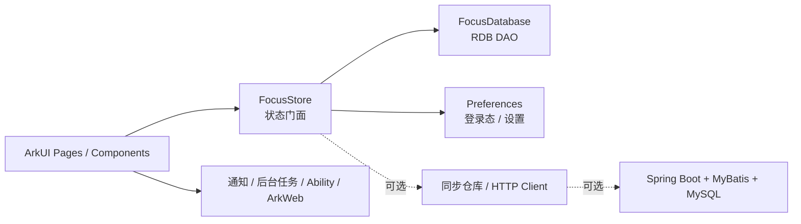

# Focus 需求文档

课程：鸿蒙应用开发期末大作业  
项目定位：本地优先的学习专注与任务管理 App  
当前版本：2026-05-25 深度重构版  
开发者：kyc

## 1. 产品定位

Focus 是一个面向大学生和自我驱动学习者的本地优先效率工具。它不是一个必须联网才能使用的“端云协同系统”，而是一个可以在手机上稳定完成任务管理、番茄专注、复盘统计的成熟小产品。

后端 Spring Boot 服务保留为可选能力，用于课程中的前后端联调、数据备份、同步接口展示；它不能成为 App 的使用前提。用户在没有网络、没有启动后端、或者只想用游客模式时，也应能完整使用核心功能。

### 1.1 核心价值

- 快速记录今天要做的学习任务，不被复杂表单打断。
- 选择一个任务进入番茄专注，并把完成或中断真实记录下来。
- 在复盘页看到学习时长、完成率、中断次数、项目分布和连续打卡。
- 数据优先保存在本机 RDB 和 Preferences 中，离线可用、可解释、可答辩。
- 后端作为可选同步层，展示 Java / Spring Boot / MyBatis / MySQL 的课程能力。

### 1.2 产品原则

- 核心流程必须稳定：新增任务、完成任务、删除恢复、完成番茄、中断番茄、查看复盘。
- 本地数据是第一可信来源，后端失败不回滚本地操作。
- UI 以高频使用为目标，克制、清晰、低干扰，不堆砌装饰和概念。
- 课程知识点服务于产品闭环，不为了覆盖清单而牺牲可用性。
- 可选能力必须分层呈现：已完成、建议展示、加分扩展分别说明。

## 2. 用户与场景

### 2.1 目标用户

- 需要管理课程作业、实验、复习、项目任务的大学生。
- 希望用番茄钟训练专注、减少中断的人。
- 需要在期末答辩中展示鸿蒙前端、本地持久化、ArkWeb 和可选后端联调的开发者。

### 2.2 典型场景

1. 用户打开 App，使用本地账户或游客模式进入。
2. 在“今日”页快速添加学习任务。
3. 点击任务进入专注模式，完成 25 分钟番茄或记录中断原因。
4. 回到任务页查看任务状态，必要时软删除或恢复。
5. 在复盘页查看本周专注时长、项目占比、完成与中断情况。
6. 若后端服务已启动，可在演示中说明本地数据可通过同步接口备份到 Spring Boot + MySQL。

## 3. 信息架构

App 使用一个主入口加四个核心区域。

### 3.1 登录 / 本地身份

必做：

- 本地账户登录。
- 游客模式。
- 登录态、昵称、游客标记存入 Preferences。
- 明确提示“本地优先 / 可选同步”，避免用户误以为必须联网。

可选：

- 对接后端 `/api/user/login` 与 `/api/user/register`。
- 保存后端 `token`、`userId`、同步游标。

### 3.2 今日

目标：让用户一眼知道下一步该做什么。

必做：

- 今日主视觉：当前学习状态、今日完成率、专注分钟、连续天数。
- 下一段专注任务。
- 快速添加任务。
- 今日待办列表，按优先级和截止时间排序。
- 任务完成、软删除入口。
- 空状态：没有任务时提示添加下一项学习任务。

### 3.3 任务

目标：支持任务扫描、筛选、恢复，不做复杂企业级项目管理。

必做：

- 全部任务列表和回收站。
- 搜索标题、备注、标签。
- 按项目筛选。
- 按四象限优先级筛选。
- 完成 / 取消完成。
- 软删除 / 恢复。
- 滚动列表满足课程列表实践要求。

后续可做：

- 编辑任务详情。
- 子任务编辑。
- 截止时间选择器。
- 本地通知提醒。

### 3.4 专注

目标：让计时、完成、中断成为稳定闭环。

必做：

- 经典番茄时长，默认 25 分钟。
- 开始、暂停、完成、重置。
- 中断原因记录。
- 完成番茄后写入 RDB，并增加对应任务番茄数。
- 中断番茄写入 RDB，复盘页可统计。
- 后台任务保护和通知封装以 best-effort 方式运行，设备不支持时给出温和提示。

建议展示：

- 独立 `FocusAbility`，使用 singleton 启动模式。
- Want 参数传入 `taskId` 和 `taskTitle`。
- 冷启动 `onCreate` 与热启动 `onNewWant` 均解析 Want，防止热启动失效。

后续可做：

- 自定义专注 / 短休 / 长休时长持久化。
- AVPlayer 白噪音真实素材。
- 震动提醒。

### 3.5 复盘

目标：让学习反馈可见，并展示 ArkWeb 混合开发。

必做：

- 原生 KPI：总专注分钟、完成率、最长 streak。
- 周学习时长。
- 项目时间占比。
- 完成与中断统计。
- 学习森林或轻量成就系统。
- ArkWeb 加载 `rawfile/charts/index.html`。
- ArkTS 注入 bridge，H5 从同一份本地 store 读取统计数据。

说明：

- ArkWeb 预览器不完整支持，需模拟器或真机验证。
- 原生图表作为兜底，不强依赖第三方 `@ohos/mpchart`。

## 4. 架构设计

### 4.1 总体架构

### 4.2 前端分层

- `models/`：任务、项目、番茄、设置、统计点等类型。
- `data/`：默认项目、示例任务、默认设置，仅用于首次初始化。
- `services/FocusDatabase.ets`：RDB 建表、迁移、查询、写入。
- `services/FocusStore.ets`：页面可直接使用的状态门面，所有任务和番茄写操作都通过它进入数据库。
- `repository/AuthRepository.ets`：本地登录态与游客模式，使用 Preferences。
- `services/FocusNativeServices.ets`：通知、后台任务保护等原生能力封装。
- `pages/Index.ets`：主体验页，承载四个 Tab。
- `pages/FocusSolo.ets` 与 `focusability/FocusAbility.ets`：独立专注窗口。
- `rawfile/charts/index.html`：ArkWeb 复盘页。

当前为了期末交付稳定，`FocusStore` 保留为兼容门面，没有强行拆成大量抽象类。后续如继续工程化，可把 UI section 逐步提取到 `components/` 和 `viewmodel/`。

### 4.3 本地数据流

启动流程：

1. `Index` 获取 `UIAbilityContext`。
2. 初始化 `FocusDatabase`。
3. 创建或迁移 `projects`、`tasks`、`pomodoros` 表。
4. 如果数据库为空，写入默认项目、任务和番茄记录。
5. `FocusStore.refresh()` 从 RDB 读取快照。
6. 页面状态从 `FocusStore` 同步。
7. `AuthRepository` 从 Preferences 恢复本地账户或游客状态。

任务写入流程：

1. UI 调用 `focusStore.addTask / toggleTask / softDeleteTask / restoreTask`。
2. `FocusStore` 先写入 RDB。
3. 写入完成后 `refresh()`。
4. 页面 `syncFromStore()` 刷新 Today / Tasks / Review。

番茄写入流程：

1. UI 或独立 `FocusAbility` 完成 / 中断番茄。
2. `FocusStore.recordPomodoro()` 写入 `pomodoros`。
3. 完成番茄时同步更新任务 `pomodoro_count`。
4. 复盘统计从 `FocusStore.pomodoros` 和 `FocusStore.tasks` 计算。

### 4.4 时间与数据格式

- 所有时间戳使用 Unix milliseconds。
- RDB 使用整数保存时间。
- `tags`、`subtasks` 用 JSON 字符串保存到 RDB。
- 查询 `ResultSet` 必须在 `finally` 中释放。
- 任务状态：`0 TODO`，`1 DONE`，`2 DELETED`。
- 番茄完成状态：`1 completed`，`0 interrupted`。

## 5. 本地数据库设计

### 5.1 projects

| 字段 | 类型 | 说明 |
| --- | --- | --- |
| id | INTEGER PRIMARY KEY | 项目 ID |
| name | TEXT | 项目名称 |
| color | TEXT | 展示色 |
| icon | TEXT | 图标或缩写 |
| updated_at | INTEGER | 更新时间 |
| is_deleted | INTEGER | 软删除标记 |

### 5.2 tasks

| 字段 | 类型 | 说明 |
| --- | --- | --- |
| id | INTEGER PRIMARY KEY AUTOINCREMENT | 任务 ID |
| title | TEXT | 标题 |
| note | TEXT | 备注 |
| project_id | INTEGER | 项目 ID |
| priority | INTEGER | 四象限优先级 |
| due_at | INTEGER | 截止时间 |
| status | INTEGER | 待办 / 完成 / 删除 |
| pomodoro_count | INTEGER | 完成番茄数 |
| created_at | INTEGER | 创建时间 |
| updated_at | INTEGER | 更新时间 |
| completed_at | INTEGER | 完成时间 |
| tags_json | TEXT | 标签 JSON |
| subtasks_json | TEXT | 子任务 JSON |

### 5.3 pomodoros

| 字段 | 类型 | 说明 |
| --- | --- | --- |
| id | INTEGER PRIMARY KEY AUTOINCREMENT | 番茄记录 ID |
| task_id | INTEGER | 关联任务 |
| start_at | INTEGER | 开始时间 |
| duration | INTEGER | 持续秒数 |
| completed | INTEGER | 1 完成 / 0 中断 |
| interrupt_reason | TEXT | 中断原因 |
| updated_at | INTEGER | 更新时间 |

### 5.4 Preferences

- 本地 token。
- 用户名、昵称、游客标记。
- 未来可保存番茄时长、通知开关、主题色、后端 baseUrl、同步游标。

## 6. 可选后端设计

后端不是 App 的主线依赖，而是课程全栈展示层。

### 6.1 技术栈

- Spring Boot。
- MyBatis。
- MySQL。
- Maven。
- Lombok。

### 6.2 建议接口

| 模块 | 方法 | 路径 | 说明 |
| --- | --- | --- | --- |
| 用户 | POST | `/api/user/register` | 注册 |
| 用户 | POST | `/api/user/login` | 登录 |
| 任务 | GET/POST/PUT/DELETE | `/api/tasks` | 任务 CRUD |
| 项目 | GET/POST/PUT/DELETE | `/api/projects` | 项目 CRUD |
| 番茄 | GET/POST | `/api/pomodoros` | 番茄记录 |
| 统计 | GET | `/api/stats/summary` | 聚合统计 |
| 同步 | POST | `/api/sync/push` | 本地批量上传 |
| 同步 | POST | `/api/sync/pull` | 按时间拉取更新 |

### 6.3 同步原则

- 本地写入先成功，远程同步后尝试。
- 后端不可用时，UI 显示本地模式，不阻塞用户。
- 同步以批量 push / pull 为主，不把每次 UI 操作直接绑死到远程接口。
- 冲突策略第一版可使用 `updated_at` 较大者优先。
- JWT、Spring Security、复杂冲突合并属于加分项，不进入核心交付。

## 7. 鸿蒙课程能力映射

| 能力 | 项目体现 | 优先级 |
| --- | --- | --- |
| ArkTS 语法与声明式 UI | `Index.ets` 四个 Tab、表单、列表、计时器、统计视图 | 核心 |
| 状态管理 | `@State`、`@StorageProp`、`AppStorage`、`FocusStore` | 核心 |
| UIAbility | `EntryAbility` + `FocusAbility`，singleton 独立专注窗口 | 核心 |
| Want 参数 | `taskId`、`taskTitle` 冷热启动解析 | 核心 |
| Preferences | 本地登录态、游客模式 | 核心 |
| RDB | 项目、任务、番茄记录真实持久化 | 核心 |
| ResultSet 释放 | DAO 查询统一 `finally close()` | 核心 |
| ArkWeb | rawfile H5 复盘页 + bridge 注入 | 展示 |
| 后台任务 / 通知 | 番茄运行保护和完成提醒封装 | 展示 |
| 服务卡片 | 展示今日待办和进度 | 展示 |
| Spring Boot 联调 | optional `focus-server` | 展示 |
| RCP / 分布式 / AI / JWT | 后续加分扩展 | 可选 |

## 8. 非目标与取舍

以下内容不作为当前核心验收项：

- 强制联网登录。
- 后端作为唯一数据源。
- 完整 JWT / Spring Security。
- RCP 高性能通信。
- 分布式数据对象跨设备同步。
- AI 自动排程。
- 第三方原生图表库强依赖。
- 完整 AVPlayer 白噪音素材管线。
- 签名 HAP，签名依赖个人证书配置。

这些方向可以写在答辩的后续规划中，但不应影响核心产品稳定。

## 9. 验收标准

核心验收：

- App 可以在不启动后端的情况下进入本地账户或游客模式。
- 可以新增任务。
- 可以完成、删除、恢复任务。
- 可以启动番茄、暂停、完成，并写入本地记录。
- 可以记录中断原因。
- 关闭重开后，任务和番茄记录仍从 RDB 恢复。
- 复盘页统计来自本地真实数据，而不是固定假数据。
- ArkWeb 页面从 `rawfile/charts/index.html` 加载。
- 独立 `FocusAbility` 能接收 Want 参数，冷启动和热启动均有效。
- 服务卡片配置不破坏构建。
- 前端 HAP 能编译通过。
- 后端 Maven package 能通过，或清楚记录环境原因。

体验验收：

- 第一屏能看懂当前产品是本地优先。
- 今日页能明确引导下一步专注任务。
- 任务页筛选和回收站不拥挤。
- 专注页运行时视觉干扰少。
- 空状态和失败提示不出现调试口吻。

文档验收：

- `需求文档.md` 与实际实现一致。
- `HANDOVER.md` 记录当前架构、构建命令、已知限制和后续建议。

## 10. 交付物

- 鸿蒙前端源代码。
- 未签名 HAP 构建产物：`entry/build/default/outputs/default/entry-default-unsigned.hap`。
- 可选后端源代码：`focus-server/`。
- 后端 jar：`focus-server/target/focus-server-0.0.1-SNAPSHOT.jar`。
- MySQL 初始化 SQL。
- 需求文档与交接文档。
- 答辩时建议准备 3 到 5 分钟演示：本地登录、任务 CRUD、番茄完成/中断、复盘、ArkWeb、服务卡片、可选后端接口说明。

## 11. 后续优化路线

优先级 P1：

- 在模拟器或真机完整走查本地流程。
- 把番茄时长、通知开关写入 Preferences。
- 补任务编辑详情页。

优先级 P2：

- 增加手动同步按钮和后端 baseUrl 设置。
- 对接 `/api/sync/push` 和 `/api/sync/pull`。
- 补同步状态：本地、同步中、已同步、失败。

优先级 P3：

- AVPlayer 白噪音。
- JWT / Spring Security。
- RCP 或分布式数据。
- AI 自动估时和优先级建议。
- 更完整的平板一多布局。
